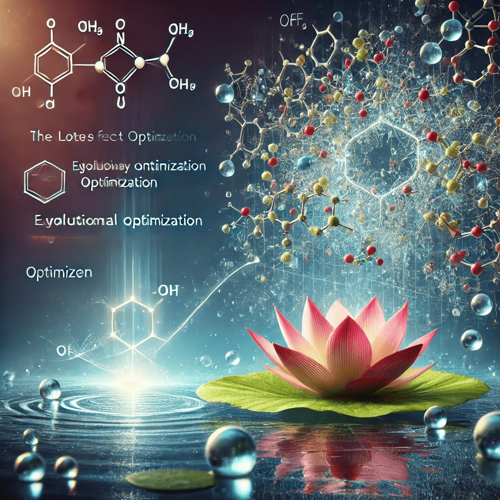

# MOF-LENS: Latent Evolutionary Navigation System for Smart MOF Discovery and Optimization by the Lotus Effect Algorithm
**by Mehrdad Jalali**

[](https://opensource.org/licenses/MIT)
[](https://www.python.org/downloads/)
**Date:** November 16, 2025 | **Location:** Germany (DE)

**MOF-LENS** is a **drug-agnostic, AI-powered platform** for designing **pH-responsive metal–organic frameworks (MOFs)** as **intelligent nanocarriers**.

It integrates:
- **Latent-space kNN mapping** from 6D structural/chemical descriptors to real MOFs  
- **Lotus Effect Algorithm (LEA)** — adaptive Lévy flights + self-cleaning diversity control  
- **Multi-objective fitness** balancing *pore size, drug compatibility, pH stability, biocompatibility*  
- **Mechanistic validation** via molecular docking (pH 7.4 vs 5.5)  
- **Instant retargeting** to other drugs (e.g., Paclitaxel)

<p align="center">
  
</p>

---

## 📁 Repository Structure

```bash
MOF-LENS/
│
├── data/
│   └── MOF.csv                     # 10,000+ MOFs: Refcode, PLD, ASA, void_fraction, linker SMILES, etc.
│
├── results/                        # DOX optimization outputs
│   ├── raw/                        # Per-run results (LEA_run_0.csv, LEA_run_1.csv, ...)
│   ├── plots/                      # Convergence, SHAP, sensitivity, diversity ablation
│   ├── top5_frequency_lea.csv      # Top-5 MOFs (frequency + metal + IUPAC linker names)
│   └── top5_with_docking.csv       # DOX docking: ΔG (pH 7.4/5.5), ΔΔG, poses, IUPAC linkers
│
├── results_ptx/                    # Paclitaxel retargeting
│   └── top5_ptx.csv                # PTX-optimized MOFs (PLD ≈ 21 Å)
│
├── src/
│   ├── algorithms.py               # LEA, GA, PSO, Random Search, Filter baseline
│   ├── fitness.py                  # Multi-objective fitness: PLD, chem_sim, pH stability, NH₂, toxicity, hydrophobicity
│   ├── data_preprocessing.py       # Latent-space kNN, normalization, SMILES sanitization
│   ├── experiments.py              # Full pipeline: 30 runs, stats, plots
│   ├── validation/
│   │     └── docking.py            # AutoDock Vina (pH 7.4 & 5.5)
│   └── analysis.py                 # SHAP, weight sensitivity, diversity ablation
│
├── config.yaml                     # DOX optimization config
├── config_ptx.yaml                 # PTX retargeting config
├── main.py                         # Run full DOX experiments
├── demo_retargeting.py             # PTX proof-of-concept
├── ListTop5.py                     # Merges top 5 + IUPAC + docking
│
├── requirements.txt                # pip install -r requirements.txt
├── README.md                       # This file
└── LICENSE
```

---

## 🚀 Quick Start

```bash
# 1. Clone and install
git clone https://github.com/yourname/MOF-LENS.git
cd MOF-LENS
pip install -r requirements.txt

# 2. Run DOX optimization (30 runs)
python main.py

# 3. Generate top-5 MOFs + IUPAC names + docking
python ListTop5.py

# 4. Retarget to Paclitaxel
python demo_retargeting.py
```

---

## 📦 Key Outputs

| File | Description |
|------|-------------|
| `results/top5_with_docking.csv` | Top MOFs with frequency, IUPAC linker names, ΔG (pH 7.4 & 5.5), ΔΔG |
| `results_ptx/top5_ptx.csv` | Paclitaxel-optimized MOFs (PLD ≈ 21 Å, hydrophobic linkers) |
| `results/plots/` | Convergence curves, SHAP, sensitivity analysis, diversity ablation, latent kNN map |

---

## 🔍 Key Features

| Component | File | Purpose |
|-----------|-------|----------|
| **LEA Optimizer** | `algorithms.py` | Bio-inspired optimization with adaptive Lévy flights + diversity control (λ_div = 0.03) |
| **Fitness Function** | `fitness.py` | Balances PLD, chemical similarity, pH stability, NH₂, toxicity, hydrophobicity |
| **Latent-Space kNN** | `data_preprocessing.py` | Maps 6D normalized features → real CSD MOFs |
| **pH Docking** | `validation/docking.py` | AutoDock Vina at pH 7.4 (blood) & 5.5 (tumor) |
| **Drug Retargeting** | `config_ptx.yaml` | 3-line change → optimize for any new drug |

---

## 📚 Citation

```bibtex
@article{MOF-LENS-2026,
  title={MOF-LENS: Latent Evolutionary Navigation System for Smart MOF Discovery and Optimization by the Lotus Effect Algorithm},
}
```

Drug-agnostic • Mechanistically validated • Fully reproducible  
**From doxorubicin to paclitaxel in 3 config lines.**
